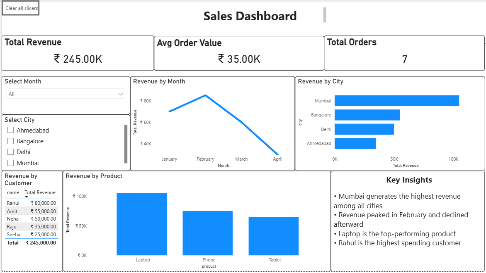

#  Sales Data Analysis Dashboard

##  Project Overview
This project analyzes an e-commerce sales dataset using SQL and visualizes key business insights using Power BI.

The goal is to transform raw data into meaningful insights related to revenue, customer behavior, and product performance.

---

##  Objective
To analyze sales data and build a dashboard that helps in understanding business performance and decision-making.

---

##  Tools & Technologies
- SQL (SQLite)
- Power BI
- DAX

---

##  Dataset
The dataset consists of three tables:
- **customers** – customer details
- **orders** – order information
- **order_details** – product and revenue data

---

## Key Analysis Performed
- Joined multiple tables using SQL
- Calculated total revenue and order metrics
- Analyzed revenue by city and product
- Identified top customers based on spending
- Evaluated monthly revenue trends

---

##  Dashboard Preview

---

## Key Insights
- Mumbai generates the highest revenue among all cities  
- Revenue peaked in February and declined afterward  
- Laptop is the top-performing product  
- Rahul is the highest spending customer  

---

##  Features
- Interactive dashboard with slicers (city, month)
- KPI cards for quick insights
- Product and customer-level analysis
- Reset filter functionality

---

##  Conclusion
This project demonstrates end-to-end data analysis:
- Data extraction using SQL  
- Data modeling and calculations using DAX  
- Data visualization using Power BI  

---
